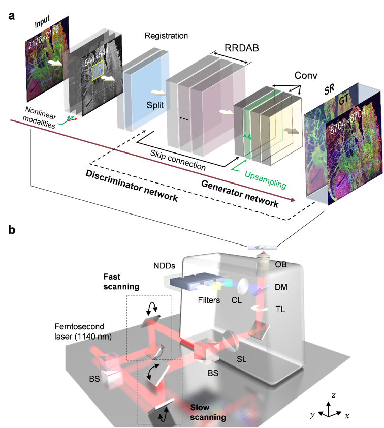

# Deep learning autofluorescence-harmonic microscopy

This project hosts the scripts for training self-alignment and attention-enhanced label-free nonlinear optical microscopy, as presented in our paper: https://www.nature.com/articles/s41377-022-00768-x


## Introduction

Laser scanning microscopies have inherent trade-offs between imaging speed, field of view (FOV), and spatial resolution due to the limitations of sophisticated mechanical and optical setups, while deep learning networks have emerged to break through these limitations without changing the system. Here, we demonstrate deep learning autofluorescence-harmonic microscopy (DLAM) based on self-alignment attention-guided residual-in-residual dense generative adversarial networks to close the gap between speed, FOV, and quality. Using the framework, we demonstrate label-free large-field multimodal imaging of clinicopathological tissues with enhanced spatial resolution and advantages in running time. Statistical quality assessments show that the attention-guided residual dense connections minimize the obstinate noises, distortions, and scanning fringes that degrade the autofluorescence-harmonic images, and avoid reconstruction artifacts of the output images. With the advantages of high contrast, high fidelity, and high speed in image reconstruction, DLAM can act as a powerful tool for noninvasive evaluation of diseases, neural activity, and embryogenesis.


## Dependencies and Installation

Python >= 3.7 (Recommend to use [Anaconda](https://www.anaconda.com/download/#linux) or [Miniconda](https://docs.conda.io/en/latest/miniconda.html))
- [PyTorch >= 1.3](https://pytorch.org/)
- NVIDIA GPU + [CUDA](https://developer.nvidia.com/cuda-downloads)

1. Clone repo

    ```bash
    git clone https://github.com/shenblin/DLAM.git
    ```

2. Install dependent packages

    ```bash
    cd DLAM
    pip install -r requirements.txt
    pip3 install torch==1.9.0+cu111 torchvision==0.10.0+cu111 torchaudio==0.9.0 -f https://download.pytorch.org/whl/torch_stable.html -i https://pypi.tuna.tsinghua.edu.cn/simple scrapy
    ```

3. Install DLAM

    Please run the following commands in the **DLAM root path** to install DLAM:<br>
    (Make sure that your GCC version: gcc >= 5) <br>
    The cuda extensions: <br>
    &emsp;[*dcn* for DLAM](basicsr/models/ops)<br>
    are necessary.

    ```bash
    python setup.py develop
    ```
   

## Dataset Preparation

Please refer to [DataPreparation.md](scripts/datasets/DataPreparation.md). It mainly includes match the low-high resolution images with ORB algorithm and how to make train, test and val datasets.


## Train and Test

- **Training and testing commands**: For single gpu, use the following command as example.<br>
1. **Training**
    ```bash
    CUDA_VISIBLE_DEVICES=0 python basicsr/train.py -opt options/train/RRDAB/train_SR_Self_Align_sesam.yml
    ```
2. **Testing**
    ```bash
    CUDA_VISIBLE_DEVICES=0 python basicsr/test.py -opt options/test/RRDAB/test_SR_Self_Align_sesam.yml
    ```
    Please see **[TrainTest.md](docs/TrainTest.md)** for detail.<br>
- **Options/Configs**: Please refer to [Config.md](docs/Config.md).<br>
For testing, you can download our pretrain model [pretrain_model_ovarian](https://drive.google.com/drive/folders/1-3Q7NRxZ38JEol6Z0EcI5niKA-DTo7KK?usp=sharing) (SR_Self_Align_x4_sesam_net_g.pth for example), and replace config pretrain_network_g in test .yml file. 
- **Postprocessing**: Please refer to [DataPreparation](scripts/datasets/DataPreparation.md). After inference, merge sub image blocks into origin size: 

## Results

For more results and further analyses, please refer to the companion paper in our [paper]().<br>


## Acknowledgement

Thanks [BasicSR](https://github.com/xinntao/BasicSR) auther Xintao Wang for the wonderful open source project!


## Citation

If you find DLAM useful in your research, please consider citing this project.
